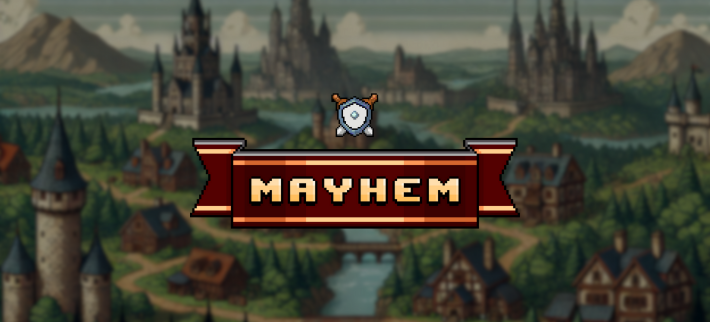
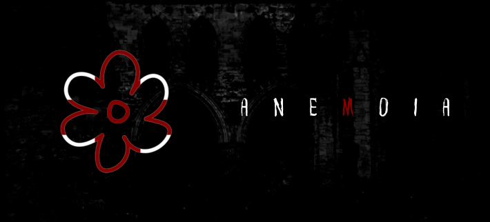

# 🌌 THE TW/LIGHT. 

The Twilight (stylized as THE TW/LIGHT) project index & official landing page.

---

<div align=center>

[](https://www.thetwlight.xyz) [](https://developer.mozilla.org/en-US/docs/Web/HTML) [](https://instagram.com/raianxh_)

</div>

## 🔗 Link

https://www.thetwlight.xyz/

---

## 🌟 Projects  

#### 🛋️ DuoRoom
*A relaxing isometric drag-and-drop game where you build and customize your perfect spot for your "duo".*  

  

---

#### 💌 Serenade
*Serenade is a tool that allows users to create 'virtual date cards' and displays a user's top most played tracks on Spotify & Last.fm.*  

  

---

#### ⚔ Mayhem
*Mayhem! is a PvP strategy duel battle where you and your opponent provided with 4 selected skills will battle to become the crowned.*  

  

---

#### 💀 Anemoia

*Anemoia is a Horror/Thriller/Mystery game where you explore a person's dream and discover the secrets on why it happened. Perhaps, he isn't just dreaming...*



---

#### 🦄 Reverie

*Reverie is a visual novel game that takes you on an ethereal journey. As the mayor of your city, your task is to help your people decide and govern them thoroughly. Your decision will affect the city and its people.*


---

## 🚀 How to Clone & Run This Repository  

Follow these steps to get started:  

### 1️⃣ Clone the Repository  
```bash
git clone https://github.com/raianah/the-twilight.git
cd the-twilight
```

### 2️⃣ Open the Index Page
```bash
xdg-open index.html  # Linux
open index.html      # Mac
start index.html     # Windows
```
or use [Live Server](https://marketplace.visualstudio.com/items?itemName=ritwickdey.LiveServer) from Visual Studio Code.

### 3️⃣ Explore the Directory
While the entire directory is not as simple as 1-2-3, it's still not as complex as you think. You can use this as your personal template but please if you did remove all images & vidoes presented in this repository.